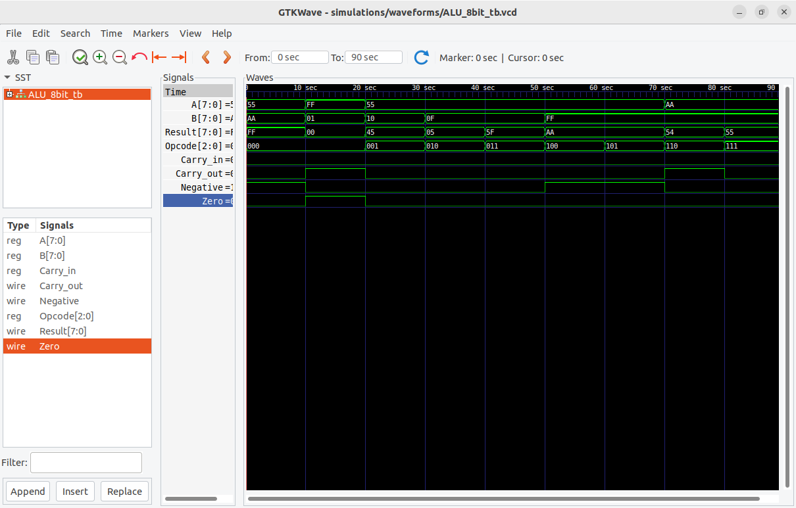

# 8-Bit Arithmetic Logic Unit (ALU) 🚀


A configurable 8-bit ALU implemented in Verilog, supporting arithmetic, logical, and shift operations with status flags.

## 📌 Features
- **Arithmetic**: ADD, SUB  
- **Logical**: AND, OR, XOR, NOT  
- **Shift Operations**: SHL (Left), SHR (Right)  
- **Status Flags**: Zero (Z), Negative (N), Carry (C)  

## 📸 Preview

*ALU*
  
*High-level design overview*

  
*Example GTKWave output*

## 🛠️ Installation
```bash
# Clone with SSH
git clone git@github.com:Vineeth-2k4/8-Bit_ALU-.git

# Install dependencies (Ubuntu)
sudo apt-get install iverilog gtkwave
